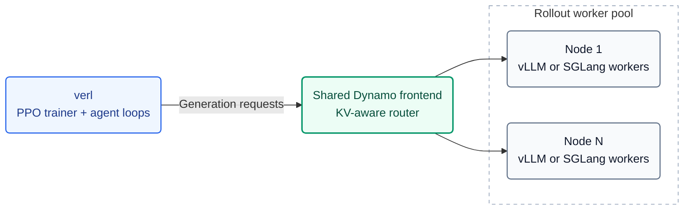

# Dynamo rollout backend for verl

Run verl training with **vLLM or SGLang** behind Dynamo's **KV-aware router**.
The recipe supports shared or separate training/rollout GPUs, weight updates,
and engine sleep/wake. All training launchers use `verl.trainer.main_ppo`.

[Architecture](#architecture) · [Quick start](#quick-start) ·
[Configuration](#configuration) · [Results](#results) · [Key files](#key-files)

## Architecture



**One frontend per rollout pool, shared across nodes and replicas.** Ray manages
one server actor per node; only the pool's first node starts the frontend,
etcd and NATS. Workers publish KV-cache events for routing. Weight updates use
node-local CUDA IPC; separate pools receive weights through verl's checkpoint
engine before applying them locally.

## Quick start

### Required versions

Use separate environments for the two inference engines. The tested versions are:

| Component | Version |
| --- | --- |
| verl | [6cbca9ce](REQUIRED_VERL.txt) |
| Dynamo | [8c5a737](https://github.com/ai-dynamo/dynamo/commit/8c5a73723109058f96c15fff3fc912231d65ad6e), after [PR #13951](https://github.com/ai-dynamo/dynamo/pull/13951) |
| Inference engine | vLLM 0.28.0 **or** SGLang 0.5.19 |
| V1 trainer | TransferQueue 0.1.9; `cupy-cuda12x` for the separate-pool NCCL backend |

Install the selected Dynamo engine and keep `etcd` and `nats-server` on `PATH`.
Place this repository at `recipe/` inside the verl checkout and run commands
from that checkout. For SGLang, unset `PYTORCH_CUDA_ALLOC_CONF`.

### Launch

Choose a preset and supply your model, datasets, and resource overrides:

```bash
export VERL_USE_EXTERNAL_MODULES=recipe.dynamo.register
python3 -m verl.trainer.main_ppo \
    --config-path ../../recipe/dynamo/config \
    --config-name dynamo_trainer_v1_colocate_sglang \
    actor_rollout_ref.model.path=/path/to/model \
    data.train_files=/path/to/train.parquet \
    data.val_files=/path/to/val.parquet \
    trainer.n_gpus_per_node=1 trainer.nnodes=1
```

| Preset | Trainer / placement |
| --- | --- |
| [dynamo_trainer_v1_colocate](config/dynamo_trainer_v1_colocate.yaml) | V1, vLLM, shared GPUs |
| [dynamo_trainer_v1_colocate_sglang](config/dynamo_trainer_v1_colocate_sglang.yaml) | V1, SGLang, shared GPUs |
| [dynamo_trainer_v1_separate](config/dynamo_trainer_v1_separate.yaml) | V1, separate rollout pool; vLLM by default |
| [dynamo_trainer](config/dynamo_trainer.yaml) | Legacy V0, shared GPUs |

For a small training smoke, set `MODEL_PATH`, `TRAIN_FILE` and `TEST_FILE`, then
choose one launcher. Colocate defaults to 1 GPU; separate needs at least 2:

| Placement | vLLM | SGLang |
| --- | --- | --- |
| Shared GPUs | [Colocate smoke](smoke_dynamo_v1_colocate.sh) | [Colocate smoke](smoke_dynamo_v1_colocate_sglang.sh) |
| Separate pools | [Separate smoke](smoke_dynamo_v1_separate.sh) | [Separate smoke](smoke_dynamo_v1_separate_sglang.sh) |

```bash
TOTAL_STEPS=2 bash recipe/dynamo/smoke_dynamo_v1_colocate_sglang.sh
```

The SGLang launchers include its required engine and sleep-mode settings.
The separate launchers also set the rollout pool size and batch constraints.
For 30B examples, see the [vLLM launcher](train_30b_rl_dynamo_kv_metrics.sh) and
[SGLang Slurm launcher](train_qwen3_30b_sglang.sh); adapt paths and cluster resources.

## Configuration

Dynamo options live under `actor_rollout_ref.rollout.engine_kwargs.dynamo`.
The shared defaults are in [dynamo_base.yaml](config/dynamo_base.yaml).

| Option | Purpose |
| --- | --- |
| `engine` | `vllm` or `sglang`; keep `rollout.name=dynamo` for both |
| `router_mode` | `kv`, `round-robin`, `random`, or `least-loaded` |
| `enable_kv_events` | Keep `true` for KV-aware routing |
| `thunderagent.enabled` | `false` for the built-in KV router; V1 presets set this explicitly |
| `request_completion_token_ids` | Return exact generated token IDs for RL |
| `enable_worker_system_metrics` | Required for SGLang's native control routes |
| `free_engine_on_train` | Must match `rollout.free_cache_engine` |

- **V1:** keep `agent.agent_loop_manager_class=null` to use TransferQueue.
  The legacy `DynamoAgentLoopManager` only supports V0.
- **Rewards:** use `reward.custom_reward_function.*` with either trainer.
- **Multiple nodes:** presets forward the registry through Ray's runtime environment;
  scripts also forward extra modules from the driver. Set paths and engine
  environment variables on every node before starting Ray.
- **Optional extensions:** [UniAgent variants](run_uniagent_variant.sh) cover
  ThunderAgent and native baselines; [NIXL smoke](run_nixl_smoke.sh) and
  [bandwidth probe](nixl_bench.py) cover checkpoint-engine weight transfer.

## Results

### Qwen3-30B-A3B-Base · ReTool · 8×H100

Four independent **50-step** V0 GRPO runs, each on one 8×H100 80GB node with
two TP4 replicas. Dynamo uses KV-aware routing with KV events enabled and
ThunderAgent disabled. All four runs completed training and saved step-50 checkpoints.

| Backend | gen (ms/token) ↓ | Output tokens/s ↑ | Step time (s) ↓ | W&B |
| --- | ---: | ---: | ---: | --- |
| Dynamo + vLLM | 0.210304 | 4,789.09 | 101.53 | [Run](https://wandb.ai/yangjingyi_algo/qwen3-30b-base-retool/runs/f945b6c47154) |
| Native vLLM | 0.218803 | 4,609.28 | 106.41 | [Run](https://wandb.ai/yangjingyi_algo/qwen3-30b-base-retool/runs/08746adedc30) |
| Dynamo + SGLang | 0.244768 | 4,097.10 | 123.38 | [Run](https://wandb.ai/yangjingyi_algo/qwen3-30b-base-retool/runs/b286d10e992d) |
| Native SGLang | 0.241076 | 4,572.12 | 120.00 | [Run](https://wandb.ai/yangjingyi_algo/qwen3-30b-base-retool/runs/a31f8e690eda) |

Mean `timing_per_token_ms/gen` is **3.88% lower with Dynamo + vLLM** and
**1.53% higher with Dynamo + SGLang**, relative to the matching native engine.
This metric includes tool-return context tokens; output throughput counts only
model-generated tokens. Step time is the arithmetic mean over all 50 steps.

These runs used additional experiment-specific verl/data/tool preparations.
One run per arm, evolving policies, and sparse tool use limit the conclusions;
these results do not isolate the effect of KV routing. See the
[benchmark report](benchmarks/retool_h100_20260916.md) for the setup, metric
definitions and validation scope.

The subsequent `main_ppo` entry-point cleanup passed **141 CPU tests per engine**
and **6 native CLI configuration checks**. GPU training was not repeated for that cleanup.

## Key files

| File | Role |
| --- | --- |
| [register.py](register.py) | Register the Dynamo backend with verl |
| [config/](config/) | V0/V1 presets and shared defaults |
| [dynamo_async_server.py](dynamo_async_server.py) | Shared frontend, worker pool and lifecycle |
| [dynamo_rollout.py](dynamo_rollout.py) | Select the vLLM or SGLang adapter |
| [dynamo_agent_loop.py](dynamo_agent_loop.py) | Agent-loop clients and async integration |
